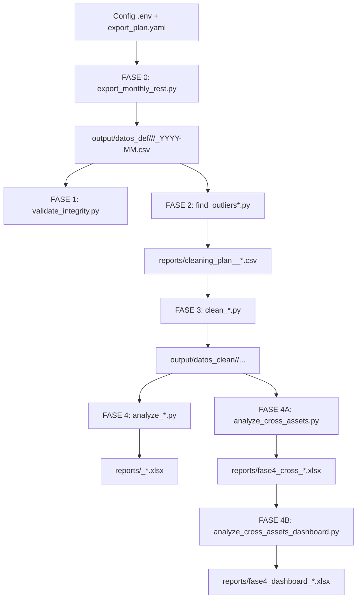

# Pipeline (fases 0–4B)

## Notas

- **Fase 0** usa REST y plan YAML para definir targets/keys.
- **Fase 2** genera el plan de limpieza que **Fase 3** consume.
- **Fase 4A/4B** dependen de `output/datos_clean` con subcarpetas por grupo.

> **Asunción**: se ejecutan las fases en orden; los scripts no validan dependencias implícitas.
